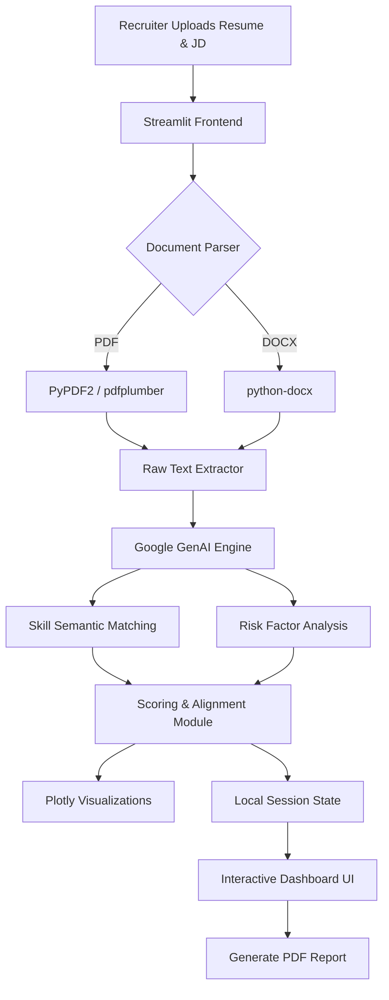

# 🧠 ResuMetrics: AI Recruitment Intelligence Platform

## 1. Business Problem
In modern recruitment, hiring managers and recruiters are inundated with hundreds of applications for a single open role. Manually reviewing resumes is:
*   **Time-Consuming:** It takes substantial manual effort to cross-reference candidate skills with dense job descriptions.
*   **Prone to Bias:** Human fatigue can lead to inconsistent evaluations and unconscious bias.
*   **Inefficient:** Standard keyword-matching ATS (Applicant Tracking Systems) often discard strong candidates who use different terminology for the same skills.

## 2. Possible Solution
A highly intelligent, automated parser that doesn't just look for exact keyword matches, but semantically understands the candidate's experience. This tool would quantify a candidate's fit for a role, provide visual alignment metrics, and instantly flag potential red flags or missing core competencies.

## 3. Implemented Solution
**ResuMetrics** is a comprehensive, enterprise-grade AI Resume Intelligence Platform. It ingests resumes (PDF/DOCX) and Job Descriptions, utilizing Natural Language Processing and Generative AI to deliver:
*   **Candidate Scoring:** Objective 0-9 metrics based on domain expertise and experience.
*   **Alignment Dashboard:** Interactive radar charts mapping candidate skills directly against job requirements.
*   **Risk & Weakness Insights:** Automated identification of potential red flags (e.g., missing critical tools, employment gaps).
*   **Automated Reporting:** Instantly generated, comprehensive PDF summaries for hiring managers.

## 4. Tech Stack Used
*   **Frontend / UI:** Streamlit (Custom HTML/CSS for advanced modern theming)
*   **Data Visualization:** Plotly
*   **Data Manipulation:** Pandas, NumPy
*   **Machine Learning / AI:** Scikit-learn, Google GenAI API (`google-genai`)
*   **Document Parsing:** PyPDF2, pdfplumber, python-docx
*   **Database / Auth:** Supabase
*   **Report Generation:** fpdf2, reportlab

## 5. Architecture Diagram



## 6. How to Run in Local Environment

Follow these steps to run ResuMetrics locally:

1.  **Clone the repository:**
    ```bash
    git clone https://github.com/AtlaVivek/abcd-agentic-training-vnr-vivek.git
    cd ResuMetrics
    ```

2.  **Create a Virtual Environment:**
    ```bash
    python -m venv venv
    # Windows
    venv\Scripts\activate
    # macOS/Linux
    source venv/bin/activate
    ```

3.  **Install Required Dependencies:**
    ```bash
    pip install -r requirements.txt
    ```

4.  **Set Environment Variables:**
    Create a `.env` file or `secrets.toml` in your `.streamlit` folder containing your `SUPABASE_URL`, `SUPABASE_KEY`, and `GEMINI_API_KEY`.

5.  **Run the Application:**
    ```bash
    streamlit run app.py
    ```
    Access the app locally via `http://localhost:8501`.

    *Note: Use demo accounts (`admin` / `admin123` or `recruiter` / `pass123`) to test the UI without full DB configuration.*

## 7. References and Resources Used
*   **Streamlit Documentation:** For advanced session state management and custom component creation.
*   **Plotly Python Open Source Graphing Library:** For drawing custom radar and horizontal bar charts.
*   **Google Gemini API Docs:** For prompt optimization and structural JSON outputs.
*   **Supabase Documentation:** For user authentication and role-based access control.

## 8. Recording
*(Insert link to a GIF or Video detailing the user flow: Logging in -> Uploading Resume -> Viewing Dashboard -> Exporting Report)*
`[Placeholder for Demo Video]`

## 9. Screenshots

| Login Screen |
| :---: | :---: |
| 
| Main Dashboard Overview |
 | 
|

| Alignment Radar Chart |
| :---: | :---: |
| 
| Risk Analysis View |
 |
 |


## 10. Proper Formatting and Alignment
Codebase follows standard PEP-8 style guidelines with modular architecture. The repository separates concerns efficiently into:
*   `/pages`: Individual analytical views.
*   `/utils`: Core parsing and database logic.
*   `/styles`: Unified design system injection.
*   `/models`: ML model weights/logic.

## 11. Problems that you faced and its solutions

1.  **Problem: Streamlit Default Theming Overriding Custom Styles**
    *   *Issue:* The Streamlit engine injected light-mode global CSS (`.stAppViewContainer`) dynamically, causing our custom glassmorphism login forms and dark-blue gradients to render out-of-order, leading to invisible text.
    *   *Solution:* We solved this by conditionally loading the global `theme.py` *only after* authentication checks, ensuring the custom Login UI styles were isolated. We also targeted `.stApp` and `[data-testid="stAppViewContainer"]` with `!important` to force overrides.
2.  **Problem: Complex PDF Layout Extraction**
    *   *Issue:* Many resumes use intricate columns, invisible tables, or heavy graphical designs, causing basic text extractors (like PyPDF2) to fail or output unreadable jumbled text.
    *   *Solution:* Implemented a fallback parsing architecture. If PyPDF2 returns low-quality or disjointed strings, the system dynamically fails over to `pdfplumber`, which excels at spacial awareness parsing.
3.  **Problem: LLM Output Consistency**
    *   *Issue:* When asking standard Generative AI to "score" a candidate, the output formatting wasn't deterministic, breaking the downstream ingestion logic into the Plotly dashboard.
    *   *Solution:* Implemented strict prompt-engineering constraints to force standard JSON-schema outputs, paired with robust python try/except dictionary parsing to ensure pipeline stability. 
